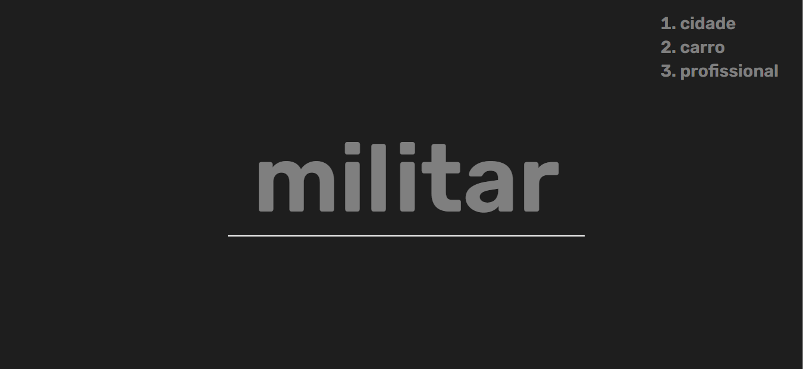
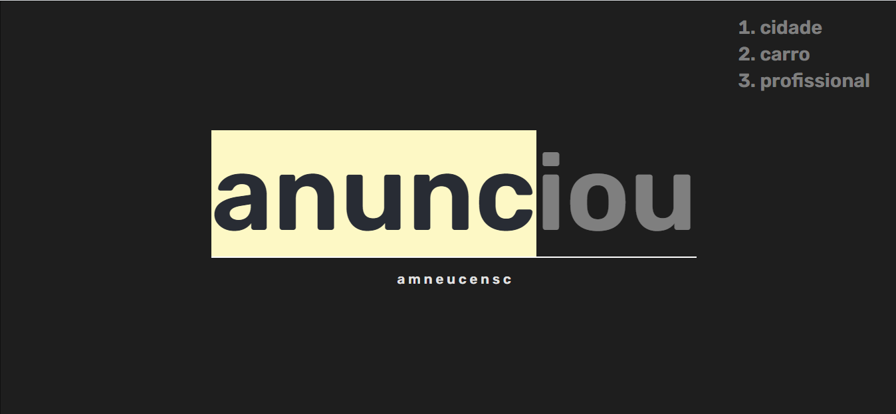

#  MARATONA JAVASCRIPT 3

Foi desenvolvido em React Js.

Para criar o Front-End 

### Dependência.

```javascript    
    "@testing-library/jest-dom": "^5.11.4",
    "@testing-library/react": "^11.1.0",
    "@testing-library/user-event": "^12.1.10",
    "react": "^17.0.2",
    "react-dom": "^17.0.2",
    "react-scripts": "4.0.3",
    "web-vitals": "^1.0.1"
```

<!-- ### Dependência de Desenvolvimento.

```javascript    
    "@angular-devkit/build-angular": "~0.6.6",
    "@angular/cli": "~6.0.7",
    "@angular/compiler-cli": "^6.0.3",
    "@angular/language-service": "^6.0.3",
    "@types/jasmine": "~2.8.6",
    "@types/jasminewd2": "~2.0.3",
    "@types/jwt-decode": "^3.1.0",
    "@types/node": "~8.9.4",
    "codelyzer": "~4.2.1",
    "jasmine-core": "~2.99.1",
    "jasmine-spec-reporter": "~4.2.1",
    "karma": "~1.7.1",
    "karma-chrome-launcher": "~2.2.0",
    "karma-coverage-istanbul-reporter": "~2.0.0",
    "karma-jasmine": "~1.1.1",
    "karma-jasmine-html-reporter": "^0.2.2",
    "protractor": "~5.3.0",
    "ts-node": "~5.0.1",
    "tslint": "~5.9.1"
``` -->

# ScreenShot

## Página - a palavra que vai aparecer para a pessoa digitar
<p align="center">

</p>

## Página - as letras que a pessoa for acertando vai ficando de uma outra cor e um background - e abaixo da palavra aparece todas as letras que a pessoa digitar.
<p align="center">

</p>


<!-- # CERTIFICADO


<p align="center">

</p>
<h1 align="center">💻 Desenvolvido Por: Gilberto Júnior</h1> -->
